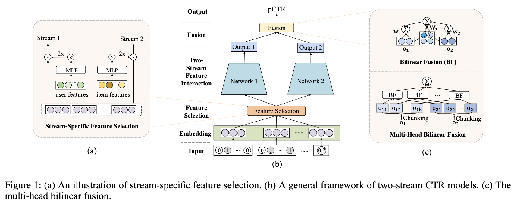

# FinalMLP

[FinalMLP: An Enhanced Two-Stream MLP Model for CTR Prediction](https://arxiv.org/abs/2304.00902v3) is a state-of-the-art deep learning achitecture specifically designed for CTR prediction tasks. Instead of relying on specific interactions layers as in other SOTA models for CTR prediction such as AutoInt, DCN-V2, etc., FinalMLP uses two multi-layers perceptrons as well as a feature selection layer using a gate mechanism, and an aggregation layer combining the representation of the two-stream MLPs. This architecture offers very good performance while being rather simple, light-weight and fast to train.

In the implemention of this repository, we use only one embedding layer projecting the whole input vector to the embedding space. Nevertheless it can easily adapted to use multiple distinct embedding projections per modality (for instance one for user features, one for item features) and dedicated MLP streams learning modality-specific representations.



## Dependencies

Thie repository has the following dependencies:
- python 3.9+
- pytorch 2.0+ (only for pytorch implementation)
- tensorflow 2.12+ (only for tensorflow implementation)

## Getting Started

This repository is rather simple and only provides implementation in both Pytorch and Tensorflow but no data loading, training and inference utilities. Clone the repo and play:

```
git clone https://github.com/clabrugere/final-mlp.git
```

## Usage

Import the module supporting the framework of your choice and train. For example with Tensorflow:
 ``` python
# load your tensorflow dataset
train_data = ...
val_data = ...

 model = FinalMLP(
    dim_input=num_features,
    num_embedding=num_embedding,
    dim_embedding=32,
    dropout=0.2,
)

# train the model
optimizer = tf.keras.optimizers.Adam(learning_rate=0.01)
model.compile(optimizer=optimizer, loss="binary_crossentropy")
model.fit(
    train_data,
    validation_data=val_data,
    epochs=20,
)

# make predictions
y_pred = model.predict(X_test)

 ```

 ## Parameters
- `dim_input` (int): number of features
- `num_embedding` (int): number of unique modalities to embed
- `dim_embedding` (int): dimension of the embedding vector
- `dim_hidden_fs` (int): hidden dimension of the feature selection MLP
- `num_hidden_1` (int): number of layers in stream 1 MLP
- `dim_hidden_1` (int): hidden dimension of the stream 1 MLP
- `num_hidden_2` (int): number of layers in stream 2 MLP
- `dim_hidden_2` (int): hidden dimension of the stream 2 MLP
- `num_heads` (int): number of chunks to split the latent representations in for the bilinear aggregation layer 
- `dropout` (float): dropout probability for regularization
